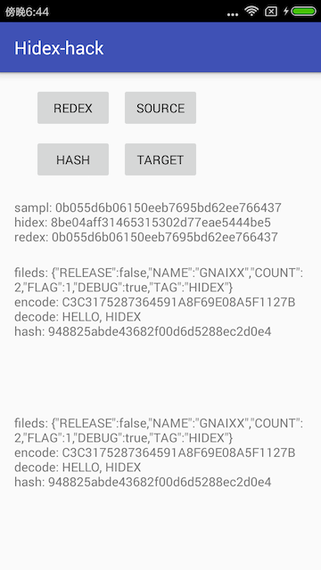

# hidex-hack

## 0x00 简介
现在部分 app 出于安全性(比如加密算法)或者用户体验(热补丁修复bug)考虑会将部分模块采用热加载的形式动态 load。
所以针对这部分的dex进行加密是有必要的，如果是修复的加密算法，你总不想被人一下就反编译出来吧。
当然也可以直接用一个加密算法对 dex 进行加密，lode 的前进行解密就可以了，但是最好的加密就是让让分不清你是否加密了。
一般逆向过程中拿到一个可以直接反编译成 java 源码的 dex 我们很可能就认为这个 dex 文件是没有加密可以分析的。

该工具主要功能实现了隐藏dex文件中关键的代码，包括静态变量的隐藏，函数的隐藏，以及整个类的隐藏，从而达到混淆的效果。
混淆后的 dex 文件可以通过像 dex2jar jade 等工具的反编译。

**效果对比:**


## 0x01 项目模块
**项目分为四个模块:**
      
- hidex-demo: 为主 module,作为测试 demo。
- hidex-samp: 为 library module 也就是需要编译成加密 dex 的模块。
- hidex-libs: 作为工具的解密部分，实际运用时只要导入该模块就调用相应接口就可以实现 dex 还原。
- hidex-tool: 作为工具的加密部分，该模块与其他模块没有依赖关系，将 hidex-samp 模块编译后 dex 扔给他加密就好。

**依赖关系:**

- hidex-demo --> hidex-libs
- hidex-samp --> hidex-libs

**接口定义:**
hidex-libs 中定义了 `Entrance.java` 接口作为加密的 dex 的入口，在 hidex-samp 中实现了该接口。hidex-libs
中通过反射调用实例化，并返回 `Entrance.java` 接口。但是不能同时在 hidex-libs 和 hidex-demo 中同时创建
`Entrance.java` 接口会导致重复定义。

## 0x02 使用说明
### dex模块实现
dex 模块，也就是案例中的 hidex-samp 模块。

**1. 接口定义**
接口定义在 hidex-libs 模块中 `cc.gnaixx.hidex_libs.inter.Entrance`

```java
public interface Entrance {

    byte[] encrypt(byte[] data, byte[] key);

    byte[] decrypt(byte[] data, byte[] key);

    String md5(String data);

    String getStaticFields();
}
```

**2. 接口实现**
接口实现在 hidex-samp 模块中 `cc.gnaixx.samp.core.EntranceImpl`

```java
public class EntranceImpl implements Entrance {
    //静态变量
    private final static String TAG = "HIDEX";
    private final static boolean DEBUG = true;
    private final static boolean RELEASE = false;
    private final static int FLAG = 1;
    public final static int COUNT = 2;
    private final static byte[] NAME = new byte[]{0x47, 0x4E, 0x41, 0x49, 0x58, 0x58};

    //示例变量
    private int instanceFieldsSize = 0;
    private String instanceFieldsName = "gnaixx";

    @Override
    public String md5(String data) {/**  **/}

    @Override
    public byte[] encrypt(byte[] data, byte[] key) {/**  **/}

    @Override
    public byte[] decrypt(byte[] data, byte[] key) {/**  **/}

    @Override
    public String getStaticFields() {/**  **/}
}
```

### dex加密

**1. 编译工具:**
dex 加密操作是放在线下进行的。编译 hidex-tool 后会生成可执行 jar。./hidex-tool/build 目录下 libs 文件夹:

```shell
.
├── classes
│   └── main
├── dependency-cache
├── libs
│   ├── hidex-tool.jar #可执行jar
│   └── lib            #必须依赖
└── tmp
    ├── compileJava
    └── jar
```

_注意: 如果拷贝该工具考到指定文件使用，必须同时拷贝 lib文件夹。_

**2. 混淆配置:**

```bash
#    hack_class:      隐藏类定义
#    hack_sf_val:     隐藏静态变量
#    hack_me_size:    隐藏methods
#    hack_me_def:     重复函数定义（以第一个为准）
```

示例:

```bash
#隐藏整个类实现
hack_class: cc.gnaixx.samp.BuildConfig

#隐藏静态变量值
hack_sf_val: cc.gnaixx.samp.core.EntranceImpl

#隐藏函数实现
hack_me_size: cc.gnaixx.samp.core.EntranceImpl

#重复函数定义（以第一个为准）
hack_me_def: cc.gnaixx.samp.core.EntranceImpl
```

**3. hidex-tool.jar 的使用:**

```bash
#加密 option:hidex
java -jar hidex-tool.jar hidex source.dex target.dex

#解密 option:redex
java -jar hidex-tool.jar redex source.dex target.dex
```
_注意: Android library module 生成的一般是 class.jar 需要用 dex 工具转化为 dex。_

### dex解密
**1. 添加hidex-libs 依赖**

```gradle
dependencies {
    /* ...... */
    compile project(':hidex-libs')
}
```

**2.Redex And Load**

```java
public class MainActivity extends AppCompatActivity{

    public static final String HIDEX_DEX  = "hidex-samp.dex";
    public static final String REDEX_DEX  = "redex-hidex-samp.dex";
    public static final String ENTRANCE   = "cc.gnaixx.samp.core.EntranceImpl";

     @Override
     protected void onCreate(Bundle savedInstanceState) {
        super.onCreate(savedInstanceState);
        setContentView(R.layout.activity_main);

        String cachePath = this.getCacheDir().getAbsolutePath();
        ClassLoader loader = new ClassLoader(this);
        //解密 assets 文件夹中dex 解密后存放目录 /data/data/packageName/files
        loader.redexFromAssets(HIDEX_DEX, REDEX_DEX);
        /*
        //1.加密dex名 2.解密dex存放路径 3.解密dex名
        loader.redexFromAssets(HIDEX_DEX, cachePath, REDEX_DEX);
        //1.加密dex存放路径 2.加密dex名 3.解密dex存放路径 4.解密dex名
        loader.redexFromFile(redexFromFile, HIDEX_DEX, cachePath, REDEX_DEX);
        */
        Entrance entrance = loader.load(cachePath, REDEX_DEX, ENTRANCE);
    }
}
```

**3. 实现效果**

